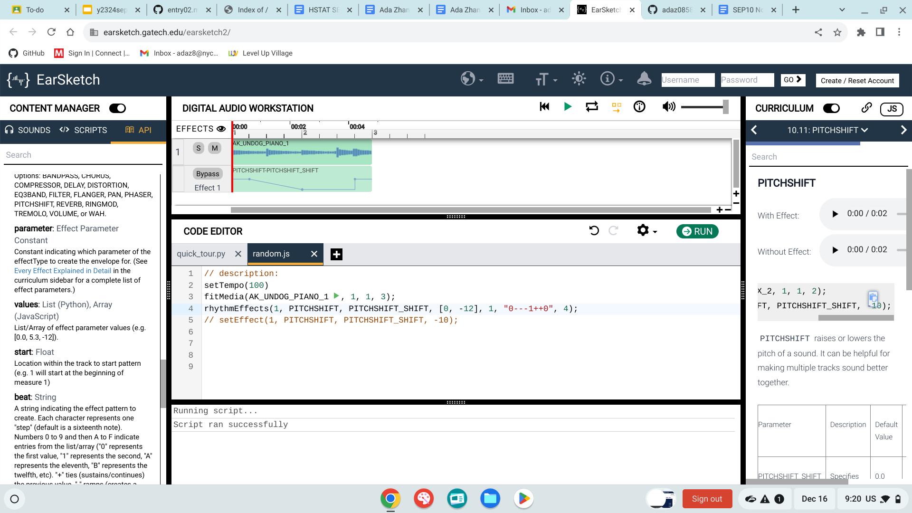

# Entry 2
## 12/18/23
## Entry 2: Deciding on Tool
### Content
I've been learning about my tool EarSketch by tinkering with their given functions of code. The first thing I learned on EarSketch was the `fitMedia()` function because the first [video](https://youtu.be/IzTgY1SLqgo?si=89TvcnY47OiMtb9m) I watched was on fitMedia. This is the easiest function because it was taught for a beginner tutorial, and even though I can be able to create a song by just using fitMedia, I still tried to learn some other functions. Since I'm making music as a background music for a game, I have to learn how to embed my music into a game. I then watched a [video](https://youtu.be/UHjTXLAS4tU?si=GEOdSMgSJWmH1yAG) on how to use `<audio>`. I also watched a video to make my earsketch music into an mp3 file because `<audio>` only works with an mp3 file. I then created a random song so I can embed it into an HTML file in my sandbox. My code:
```html
<audio control autoplay loop src = "random (1).mp3"></audio>
```
This code takes the mp3 file I created and embeded into my sandbox and also embed it into my `earsketch.html` file I created. This code allows the music I played to play as soon as I open the page and play on loop. Since the random music I used is consisted of a person singing, there would be lyrics on the bottom of the page. 
After learning `fitMedia()`, I tried to learn about `insertMedia()` since it was the closest to what fitmedia is. I learned that it's basically the same as fitMedia except that insertMedia allows you to play the full sound once so you won't have to guess how many measure a sound takes up. After learning about how to insert sounds, I need to check out on how to make the different sounds contain different effects. Then I came across the `setEffect()` function. Using this function, the first effect I used was the gain in volume effect. However, the setEffect by itself was only able to create a minor and consistant change to the sound. Therefore, I checked out the `rhythmEffects()`. I copied the example code that was given to show how `rhythmEffects()` work and compared it to the same type of effect in `setEffect()`. 
In this image, I used both `setEffect()` and `rhythmEffects()` and tried to compare the original sound, setEffect, and rhythmEffects. These are what I learned about my tool so far. I'm able to insert sounds, change tempos to create upbeat or sad music, and create different effects on the sounds.
## Next Goals
Now that I know how to insert sounds and create effects, I want to learn how to understand what the numbers and effects are. I also want Angela to create a random game so I can see how it's like if I insert my music into her game. If possible, I might also want to copy some sounds that I like and might use so I can create different types of music. 


[Previous](entry01.md) | [Next](entry03.md)

[Home](../README.md)