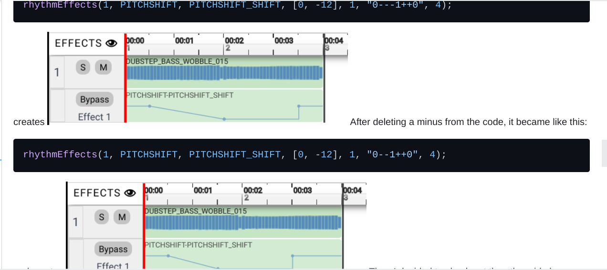
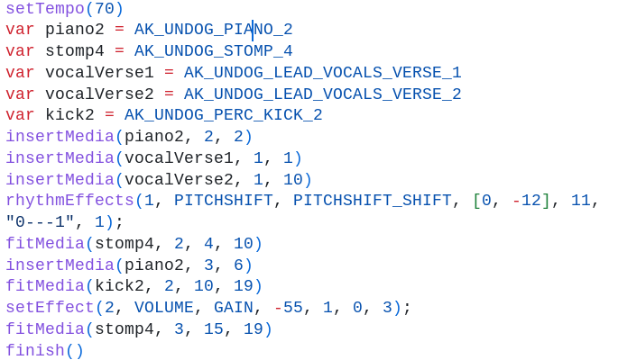

# Entry 3
## 2/12/24
## Entry 3: Tools Tinkering
### Content
I've been learning about my music tool, earsketch, for most of my journey in tool tinkering, but I also learned a bit about my game tool, kaboom, towards the end of my tool tinkering journey. After my last entry, I wanted to learn how to create my own code for `rhythmEffects()`, but I ended up learning about CHORUS for `setEffects()` instead. I took the code from the API list that was given for users to understand the different effects and used it to check out the difference in music before and after I used the effect. I learned that the CHORUS of NUMVOICES allow you to make music sound louder since it's going to sound like a chorus of people singing. Added on top of chorus, MIX  of chorus creates kind of an echoey effect like singing in an empty room. Then I tried to learn about the difference between `rhythmEffect()` and `setEffects()` since I thought they're basically the same since they're just changing effects. However, I learned that `setEffects()` only allow constant changes so no in between sounds can be changed to a different pitch while `rhythmEffects()` allow you to change inbetween pitches. As shown in this image:  I can do pitch shifts in between my song measures so the pitch can be high or low in certain parts.I didn't think I would need to learn anything new afterwards since I think I've known enough so I just used everything I learned so far: `fitMedia()`, `insertMedia()`, `setEffect()`, and `rhythmEffects()` and created a small music. These are all the code I learned so far so I used those to create a song.  The tempo of this music is only 70 because I tried making it slow so it's more suspense. I chose to create suspense music because Angela wants to create a game where there's a boss and we're trying to kill the boss. So I'm thinking the suspense music would suit the boss beating theme. In the code I used volume gain since the stomps and kicks weren't that loud while the singing is very loud. I wanted the stomps and kicks to be heard as the background of the singing. I also used pitch shift towards the end of the measure since I wanted the sound to turn from normal to kind of deep and like an evil entity. After creating a music with everything I've learned so far, I wanted to review how to embed an mp3 file into `code.dev` using the past notes I stored in my learning log since I would need to embed it to a file with the game Angela makes when she's done. After reviewing, I believe that what I know so far for earsketch would be enough for me to create fine music for Angela's background music, so I decided to help Angela with kaboom since she was struggling to get her floor level to be solid. I then created `kaboom.html` in my sandbox and copied the given code from [kaboom](https://kaboomjs.com/) and checked out what the game was about. Angela said she couldn't get the floor to be solid cause her character was just falling through the floor, so I decided to go to my code's floor section to check out my code for the floor.  I realized saw the
```js
body({ isStatic: true })
```
of my floor code so I commented it out and my sprite started to fall through the floor as well. So I told Angela that she's going to need this part of the code in order for her sprite to stop falling through the ground.

## Skills
A skill I learned is communication and organization because I had to communicate with Angela to know what she was struggling with so I can try to help her with what she needs help with. If I didn't communicate with Angela then I would either work on something that Angela already figured out, which would waste a lot of time if we're trying to figure a lot of things out, or I would work on something Angela might not even use for her game and waste time learning that. I also learned to organize my code into my learning log so I know exactly what I would write in this blog. I am also able to use my organized notes in my learning log so I can review more efficiently, knowing what I did to get my code to work.

## Next Goals
Next I plan to learn with the pace of Angela in Kaboom so whatever she needs to learn I'll try to learn with her so we can see who gets the code first and what differences are in our codes. This would allow us to use two brains for one topic so we can get the code to work quicker. If Angela finishes making something random, I might be able to embed the music I created into her game and see how it's going to work out. 

[Previous](entry02.md) | [Next](entry04.md)

[Home](../README.md)