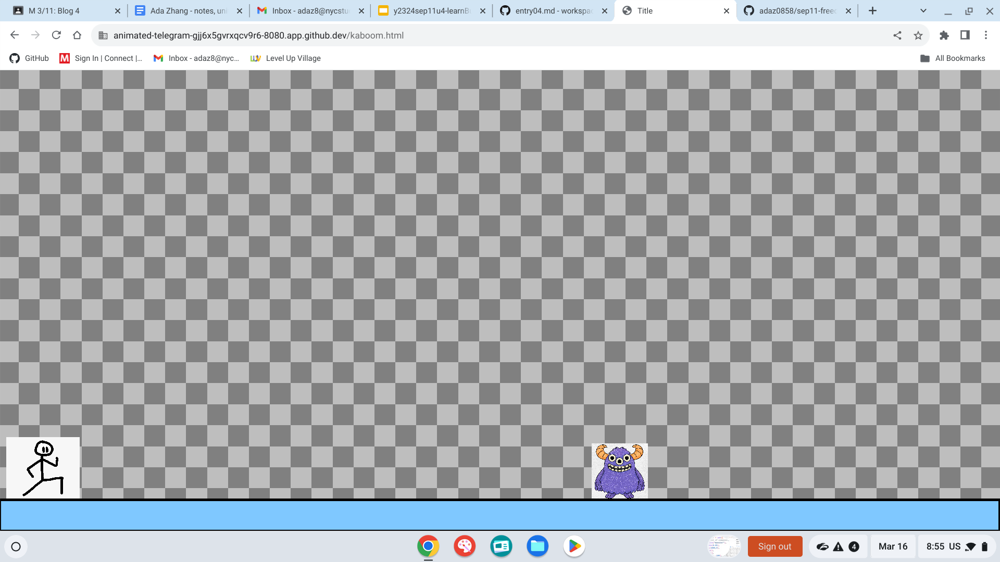

# Entry 4
## 3/18/24
## Entry 4: Kaboom Tinkering

### Content
After the last blog Angela and I completed our plan doc. We decided that we would be doing a parkour game with joyful music. This is because our MVP is just a normal parkour game with coins so it's going to be peaceful. However, it won't be so peaceful once we add mobs so I will create a suspense music once we create mobs. For the music I created, I mainly focused on using guitar sounds because it sounds peaceful like a summer day in Hawaii. I used all the concepts I've learned such as: `fitMedia()`, `insertMedia()`, and `setEffect()`. I then created an mp3 file named joyful.mp3 so I can embed it and loop the music into Angela's game.  After getting my music, I started to tinker with kaboom so I can help Angela create her game. The first day I started helping Angela with her game I just scrolled through Kaboom to check out the different functions, how and what it's used for. I learned about `body()`, `loadSprite("name", "image.png")`, and `sprite("name")`. I learned that body is used to respond to gravity so the sprite can fall and not stay fixed to the top of the screen. I then learned that loadSprite is used to load and name the sprite so you can call it using `sprite("name")`. I first loaded a stickman figure but it was really big and I didn't know how to make the sprite smaller but I then came across `scale()`. I was then able to use the scale function to scale my sprite to becoming smaller. Knowing all these I asked Angela about what she needs help with and she told me to create a sprite that moves by itself. I came across an error that said `Cannot access 'player' before initialization`. I googled the error and google said that this error often occurs when we use `const` or `let` so I used `var` instead. Since Angela wants a sprite that moves on it's own, I went to kaboom and searched up "move." I then used the `move()` function so my sprite can move itself. You need 2 values inside the parenthesis of move. I'm not sure what the value on the left is for but I know that the value on the right is the speed of how fast the sprite can move. If you make the value positive then the sprite will move right and if you make the value negative then the sprite will move left. I wanted the sprite to move randomly left and right so I searched up "rand" in short for "random" and it gave me the `rand()` function. I tried adding it into the right value of `move()`, hoping that it'll move by itself, but my sprite just ended up moving at a certain random speed every time I refresh my tab. However, I now know how `rand()` works so I can probably be able to use it in directions or something. Using all these I created a monster that moves left towards the player and pushes the player off.
This image  shows the monster when it fell to the ground and is starting to move towards the player (stickman). Then this image  shows the monster pushing the player off the screen. I created this by adding a player sprite, add a floor with gravity, and a monster sprite.
``` js
        // monster
    loadSprite("monster", "monster.jpg");
    var monster = add([
        // list of components
        sprite("monster"),
        scale(0.05),
        pos(1000,0),
        area(),
        body(),
        move(0, -100),
    ]);
```
This code is used for the monster sprite. I positioned the monster far away from the player moving at a speed of 100. I then tried to figure out how to get my sprite to jump. I used the given code for jump and it is in two separate codes, a function and an onKeyPress():
```js
     function jump() {
         if (player.isGrounded()) {
             player.jump(JUMP_FORCE);
         }
     }

//     // jump when user press space
     onKeyPress("space", jump);
     onClick(jump);
```
This code shows that the function is being created so the player can jump when they touch the ground. Then the function will be called when the space key is pressed. In the beginning, I didn't know what the function was used for so I commented out the function and it gave me an error saying, "jump is not defined" so I know that the function is to define the function of jump. I then wondered about what would happen if I commented out the conditional of `player.isGrounded()` so I commented out the conditional. Then I saw how the player can jump everytime you press the space key, even in mid air. 

### Skills
* Search up your error because it might help you understand why youg ot the error. I wouldn't have known that `const` is the problem if I didn't search up my error. All I had to do was change `const` to `var` but I wouldn't have done that if I didn't know what this error means.
* Communicate because you never know if your partner needs help with something specific. I asked Angela about what she needed help with and I was able to help her achieve a goal so she can figure out something else.
* Ask youself questions because you can answer a lot of your own questions if you try it out yourself. I asked myself what would happen if I commented out the function and what would happen if I commented out the conditional and I ended up learning something new.

### Next Goals
* Make the player lose health when it touches the monster.
* Make a health car to show player's health and make player disappear and lose if their health is 0.
* Create coins for the player to grab and kept with their score. 

[Previous](entry03.md) | [Next](entry05.md)

[Home](../README.md)