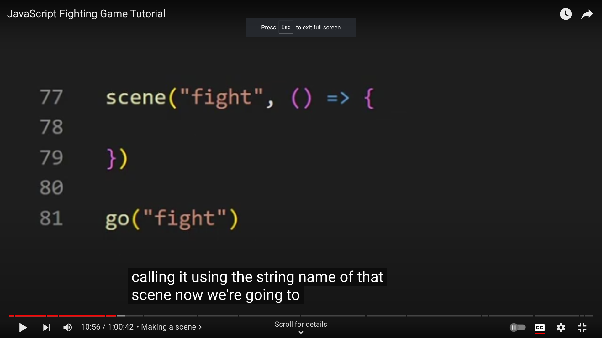

# Entry 5
## 5/6/24
## Entry 4: Finishing MVP

### Content

Angela and I have been working together to create a parkour game with a background music. We have faced many problems on our way to finishing our MVP, but we processed through and learned a lot for our game. I first looked through the code that's given for a pre-made kaboom game and I saw how there's a function of jump and a `onKeyPress` jump which I didn't understand why there needs to be both a function and onKeyPress so I commented out the function. I thought kaboom knows what jump means but after I commented out the function of jump, an error showed saying "jump is not defined." I then realized that the function of jump tells kaboom what to do when the key is pressed because kaboom itself doesn't know what jump means. I also saw how there's this code in the jump function: `if (player.isGrounded())` and after I commented this out, the sprite was able to jump continuously because I don't have to wait until the player is on the ground, I just have to wait until the player presses the space bar.

I then asked Angela what she wants me to learn next because I was able to get the monster to move without pressing any keys, and she told me to create a health bar. I then tried to use a kaboom code that is supposed to destroy the player on collide, but the code doesn't work and the monster only pushes the player away instead of exploding. Since it didn't work when I tried to kill my player from collision, I decided to try and see if I can make my player lose health due to collision, but it didn't work either. I then went to search up tutorials on YouTube and I found this [video](https://youtu.be/TLH0taCeE6I?si=h55yYJBv0mbSds1k). I skipped to the end of the video to see how I can use health and they said that you have to create a variable for your health container. I tried what the video said to do and it still didn't work so I had to watch the whole video.

Just in case the code suddenly works, I tried to use
``` js
    onCollide("stickman", "monster", () => {
    addExplosion()
    })
```
again to see if my sprite will explode after a collision and of course it still didn't work. I went back to my code and I saw that my variable for the player is named "player" and not "stickman" so I changed stickman to player but the code still didn't work.

I then made my sprite move when the right arrow is pressed and watched the [video](https://youtu.be/TLH0taCeE6I?si=h55yYJBv0mbSds1k) from the beginning. I watched the video for 20 minutes and though I didn't figure out how to use   `health()`, I learned some other things. I learned that the sprites can be animated so the character doesn't look like it's gliding.

You can name your moves randomly and give them random movementsto create your own animation. You can also use `scene` to move from one scene to another then you can use `go()` to enter that scene.

You can also use `background.add([])` to add a sprite in the background as the background character or to add on to the designs of the scene. Use `pos()` to place your sprite at a specific position.

### Skills

* I learned to watch YouTube videos for help because even though I didn't figure out what I originally wanted to figure out, I gained some new knowledge that might be useful for later on.
    * For example: Angela wanted to make the background look better and she wants to find a good looking floor and the video taught us how to make scenes and add sprites in the background.
* I also learned to ask yourself questions and comment out codes to figure out what the code does if you don't understand the code. This is because I had questions about the jump function and `onKeyPress` so I commented out one of them to figure out what the code is for.

### Next Goals

* After Angela is done with her MVP without the health bar, she's going to come over to my place some time so we can combine our files and figure out what we need to add and how to add.
    * We need the player to explode due to collision, make the sprites look better, create better background and floor, and some other beyond MVP.

[Previous](entry04.md) | [Next](entry06.md)

[Home](../README.md)