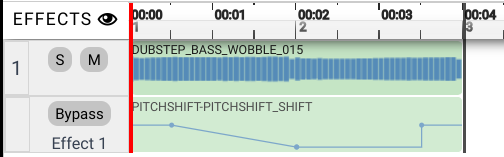
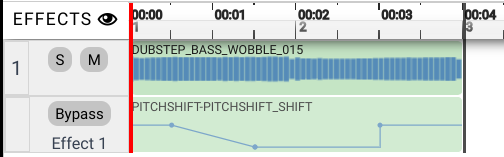
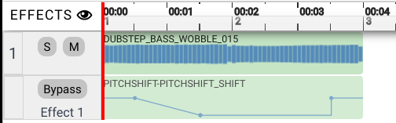

# Tool Learning Log

Tool: EarSketch

Project: Making the background music for Angela's game using EarSketch. After making my background music, I will learn ImpactJS and help Angela with creating some other parts of her game. (Where the characters catches stars and has to count the amount of stars they have so if they input the correct amount at the end, they win, but if they insert wrong amount then they lose. There would also be mobs so if the characters touches one then they lose all the stars and have to recount).

---

10/29/23:
* I watched a [YouTube tutorial](https://youtu.be/IzTgY1SLqgo?si=89TvcnY47OiMtb9m) on how to use ``EarSketch using JavaScript and I learned a tip to create a variable for each beat so I won't have to manually change everything.
* I tried, on `EarSketch`, to set up a `var` for a soundtrack and played it using `fitMedia(sound, track, start, end)`. I used the piano sound track and named it piano1. I didn't know what "track", "start", and "end" meant so I gave it different numbers. I found out that track just means what row I want my cound to be on, start is the measure where my sound starts on, and end is the measure where my sound stops on. I first tried `fitMedia(piano1, 1, 1, 2)` but the music sounded short so I changed the ending measure to 3 and it sounded more complete. I tried to change the track number to 2 to see what would happen but nothing really happened other than the sound moved from row 1 to 2.
* While typing in `fitMedia()`, I saw many other codes, I wonder what those codes are for and if I would ever have to use those. If those aren't codes then I wonder if what those are, are they just the sound names?

11/13/23
* I watched a [video](https://youtu.be/UbhdenVCgRs?si=dYNC149-12D1Xg2C) on how to make EarSketch into an mp3 file.
* Then I searched on [google](https://beta.reddit.com/r/cs50/comments/1742soy/uploading_mp3_files_to_my_final_project_folder/) for how to insert my mp3 file of the song I created in EarSketch into cs50.dev.
* Lastly, I watched a [video](https://youtu.be/UHjTXLAS4tU?si=GEOdSMgSJWmH1yAG) on how to use `<audio>`.
* Next time I want to check out other functions EarSketch has such as `makeBeat()`.
<!--
* Links you used today (websites, videos, etc)
* Things you tried, progress you made, etc
* Challenges, a-ha moments, etc
* Questions you still have
* What you're going to try next
-->

11/19/23
* Didn't really tinker too much but I looked over all the possible codes I can use in API of EarSketch.
* I used another sound where a lady was singing and created an mp3 file.
    * I found out that there will be lyrics on the bottom of the screen.

11/25/23
* I watched this [video](https://youtu.be/WA_Ci2ZtuRM?si=lZ-AS0B9XYczzU_L) on YouTube to learn what insertMedia does because I know how to use fitMedia, but I'm still learning the other functions.
* I learned that fitMedia and insertMedia are similar except for insertMedia does not have an end measure meaning it only plays the sound once.
    * This means that insertMedia is most useful when you want the sound you chose to play the whole thing without having to wonder how many measure it takes up.
    * I went on earSketch to try out insertMedia by using the first guitar sound that I used in my fitMedia before but insertMedia was better since I didn't have to replay the sound many times to see when the measure ends.
* My next step is to watch more videos on YouTube on the other functions and trying to make something using those functions.

11/27/23
* I learned a setEffect() function where I can put an effect on my volume of a specific track. I can make it gain valume so that tracks volume increases as the measure increases.
* I went to find the setEffect function in the API to see what those numbers in the parenthesis meant.

12/2/23
* I continued from 11/27 and copied the code from API for setEffect() and compared the difference between the sound with the effect of filter and without the effect.
    * I heard that the sound with the effect of filter went from really muffled to becomming clear while the sound without effect sounded the same throughout.

12/10/23
* I didn't learn anything new for this week but I combined my knowledge on what I know about `setTempo()`, `insertMedia()`, and `setEffect()` and created a small music with those functions.
* I tried making my tempo slower, hoping to create a sad song since sad songs have slow beats, but instead I created suspenseful music instead. This is fine because I am supposed to be creating suspenseful or creepy music for my freedom project with Angela.
* I also learned that for `setEffect()`, you need to write the words in capitalization in order for the code to work.
    * I wrote `setEffect(1, volume, gain, -55, 1, 0, 3)` instead of `setEffect(1, VOLUME, GAIN, -55, 1, 0, 3)` and it said that volume was not defined and my code couldn't run. This code allows my music to start out with a low volume and gain volume as the song runs.

12/16/23
* After learning that `setEffect()` is used to create different effects on a specific track, I tried to see what `rhythmEffects()` does.
* I copied the code of `rhythmEffects()` in API, `rhythmEffects(1, PITCHSHIFT, PITCHSHIFT_SHIFT, [0, -12], 1, "0---1++0", 4);`, to check out what it does to the music.
* I went to the "Every Effect Explained in Detail" link and found what PITCHSHIFT was and copied the example it gave using `setEffect()`.
    * `setEffect(1, PITCHSHIFT, PITCHSHIFT_SHIFT, -10);`
* I checked to see the difference between the two functions and saw that `setEffect()` of PITCHSHIFT makes the original music sound deeper and more muffled but the effect is more consistant; while, the PITCHSHIFT using the `rhythmEffects()` code above makes the original music deeper and muffled too, but you can change the tone of the music to make the sound go deeper or higher (Still deep and muffled though).
* I'll try to figure out how to write my own code for `rhythmEffects()` next so I understand what those numbers are used for so I won't have to only use their default numbers.

12/24/23
* Though I didn't learn how to create my own code for `rhythmEffects()`, I learned some of the `setEffects()`such as CHORUS.
* I first used the piano sound with chrous effect but the difference wasn't visible so I decided to use the lady singing.
* The CHORUS_NUMVOICES makes the sound louder if you set the number of voices to a high number.
* The MIX of chrous allows the voices to kind of sound like you're singing in an empty room.

12/31/23
* The difference between `rhythmEffects()` and `setEffect()` is that setEffect is a constant change where nothing inbetween will change. However, rhythmEffects allow the effect to change over the course of the sound by making the sound effect become higher, lower, or constant at certain parts.
* I kind of understand what the beat is for in `rhythmEffects()` by tinkering with the code.
The original code:
``` js
rhythmEffects(1, PITCHSHIFT, PITCHSHIFT_SHIFT, [0, -12], 1, "0---1++0", 4);
```
creates 
After deleting a minus from the code, it became like this:
``` js
rhythmEffects(1, PITCHSHIFT, PITCHSHIFT_SHIFT, [0, -12], 1, "0--1++0", 4);
```
and creates 
Then I decided to check out the other side by adding a plus sign:
``` js
rhythmEffects(1, PITCHSHIFT, PITCHSHIFT_SHIFT, [0, -12], 1, "0--1+++0", 4);
```
and got 
I didn't know what would happen if I changed the number 1 to 2 so I changed it and it showed an error, meaning the numbers we use can only be between 0 - 1.

1/7/24
* I don't think I would need to learn anything new so I just used everything I learned so far: `fitMedia()`, `insertMedia()`, `setEffect()`, and `rhythmEffects()`.
    * The result of the music I created was:
``` js
setTempo(70)
var piano2 = AK_UNDOG_PIANO_2
var stomp4 = AK_UNDOG_STOMP_4
var vocalVerse1 = AK_UNDOG_LEAD_VOCALS_VERSE_1
var vocalVerse2 = AK_UNDOG_LEAD_VOCALS_VERSE_2
var kick2 = AK_UNDOG_PERC_KICK_2
insertMedia(piano2, 2, 2)
insertMedia(vocalVerse1, 1, 1)
insertMedia(vocalVerse2, 1, 10)
rhythmEffects(1, PITCHSHIFT, PITCHSHIFT_SHIFT, [0, -12], 11, "0---1", 1);
fitMedia(stomp4, 2, 4, 10)
insertMedia(piano2, 3, 6)
fitMedia(kick2, 2, 10, 19)
setEffect(2, VOLUME, GAIN, -55, 1, 0, 3);
fitMedia(stomp4, 3, 15, 19)
finish()
```
* I made the tempo slower so the sounds are slower and sound a bit scarier, added stomps; kicks; and piano sounds to make the song a bit scarier, then I used `setEffect()` to gain the volume of the stomps; kicks; and piano and `rhythmEffects()` to make the sound deeper towards the end of the music.

1/14/24
* I reviewed how to embed an mp3 file into code50.dev because I realized that I kind of forgot.
* The first step is to create an mp3 file.
    * Go to scripts, find your code file, click it, click download, and download the mp3.
* Next step is to drag the mp3 file into code50.dev
* I will just take the code I used to loop the audio in my sandbox to create audio for the song.

1/28/24
* I tried to learn kaboom.js to help Angela with her levels so I watched a youtube [tutorial](https://youtu.be/iRXI6ThRJvM?si=wp04euNUhknCF1kg) on how to start kaboom.
* I then copied a game code from kaboom and everything loaded except for the sprite.
* I realized that the sprite of "bean" was not defined so I found a stickman image and used that as a sprite.
* My sprite is huge on the screen but I got my sprite to load, so my next step would be to try and get my sprite to be smaller and to study the code for levels and background to understand the code and what it does.

2/4/24
* I tried to comment the codes leaving only one section uncommented in order for me to see what each code does.
* Angela said that she needs to make the floor solid because she has a floor but her sprite just goes right through the floor.
* Since Angela mainly needs help with the level floor being solid, I focused on figuring out how to make the floor solid.
* I went to the code I copied and saw this code:
```js
body({ isStatic: true })
```
    * I tried commenting this code and I saw that my sprite also started falling through the floor after I commented this code.
* Then I just sent this code to Angela, hoping she can move on from the level.

2/25/24
* Angela and I finished our plan doc a few days ago and we decided that instead of making a suspense music, we would do a joyful music.
* I used fitMedia(), insertMedia(), and setEffect() to create a joyful music.
    * I decided to use a guitar sound as my main sound because it sounds really joyful.
    * I also added some wood, clap, and shaker sounds to make it sound more joyful (though it sounds more like a Hawaii beach day).
    * I created an mp3 file so I can embed the music into Angela's game once she creates a file for us.
    * Then I will loop the music because it's really short.

    2/26/24
* I learned that `body()` is used so the sprite can respond to gravity.
* You first have to `loadSprite("name", "image.png")` then add the `sprite("name")`.
* `scale()` allows you to change your sprite size.
* `area()` checks for collision.

3/10/24
* Angela wants to create a sprite that moves randomly so I tried to code that.
    * I then have to send the code to her because she's the main game coder.
* "Cannot access 'player' before initialization" error occurs usually with "const" and "let."
* `move(0, -100),` the quantity on the right allows the sprite to be a certain speed.
    * You can set the value as a negative so it moves left or positive so it moves right.
* `rand(number)` allows you to have a number between 0 - number.